Get answers to all your questions and learn some great tricks. 
=======
This page is for all the learners who LOVE to LEARN on the GO 🏃🏻‍♂️ Time is precious and not everyone likes to take the long trail of step by step learning but get quick answers to tricky questions. This page is for the same kind of learners.   

<!-- SECTION 1 -->
## Basics - Setup

### How to create a bot? 

Please register yourself on https://app.yellowmessenger.com/ and you can get a free bot access for 30Days. It won't take 30 Days to learn the art of bot creation but we understand 30 Days trial should be sufficient to explore all the amazing features of the platform and create awesome AI based conversations. 

Please contact sales@yellowmessenger.com for more information. 

---

### How to sign up and accept bot invite? 

This answer will help understand how a new user can register herself/himself and accept the bot invite. 
**Keywords** : invite

`Step 1` : Go to https://app.yellowmessenger.com/ and sign up with your email. Share the email with the YM team to send you the bot invite. 

`Step 2` : The bot will be visible under the ‘Invites’ section, please accept the bot invite and then it will be visible either under Sandbox/ Staging/ Production.
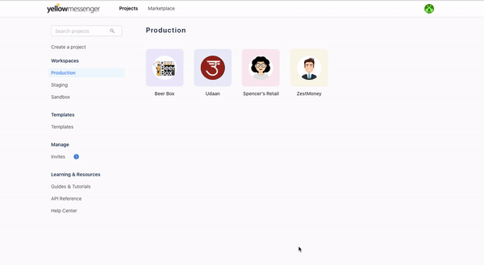

---------------------------------------

### How to share Bot Access?

**Keywords** : bot access, invite

`Step 1` : Go to configurations page inside the bot, open Access control - https://app.yellowmessenger.com/a/Your BOT ID here/config/access

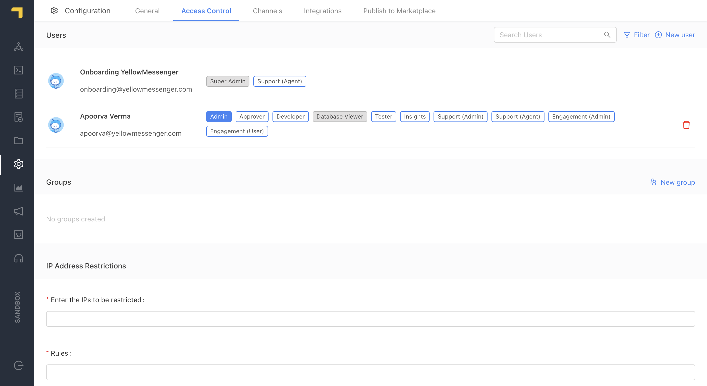

`Step 2` : The bot will be visible under the ‘Invites’ section, please accept the bot invite and then it will be visible either under Sandbox/ Staging/ Production.

---------------------------------------


### How to publish a bot?

**Keywords** : bot publish, live

`Step 1` : Check the following before pushing the bot either from sandbox to staging or staging to production. 

1. Bot Should be trained. 
2. Compare the code in the developer section
3. Test the bot and especially the changes made recently. 

`Step 2` : The bot will be visible under the ‘Invites’ section, please accept the bot invite and then it will be visible either under Sandbox/ Staging/ Production.

---------------------------------------


### How to compare code? 

**Keywords** : compare

Note : 
1. This activity can be done only when the bot has been pushed and staging/ production bots exist. 
2. Compare changes will appear only if there are changes. 
3. The following combinations can be compare. Sandbox > Staging and Staging >  Production. 


`Step 1` : Go to the developer section.

`Step 2` : Under cloud functions, on the top left you will see the COMPARE button. 

`Step 3` : Click on the compare button to see new files created (C with green)/ deleted files (D with red) and modified files (M with blue) as compared to the next environment


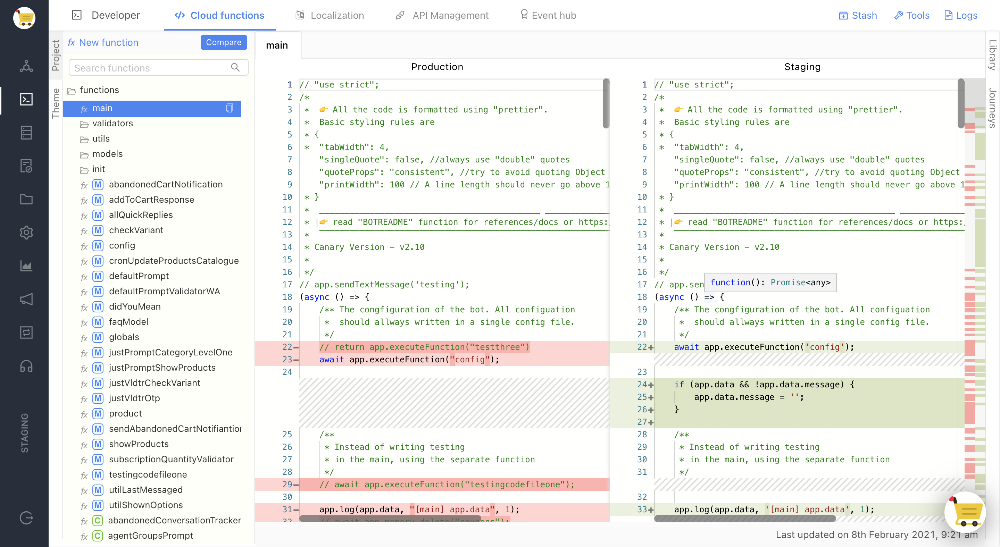

---------------------------------------
---

<!-- SECTION 2 -->
## Learn - Create / New

### How to create a new function? 
Cloud Functions compose of all the user defined functions that defines and controls the flow of the bot. The whole structure of writing the code is modularised. Main is the default function which is executed for every message. In the builder section, we can link the cloud functions directly in validators or steps or init functions by selecting the corresponding cloud function created in Developer section.

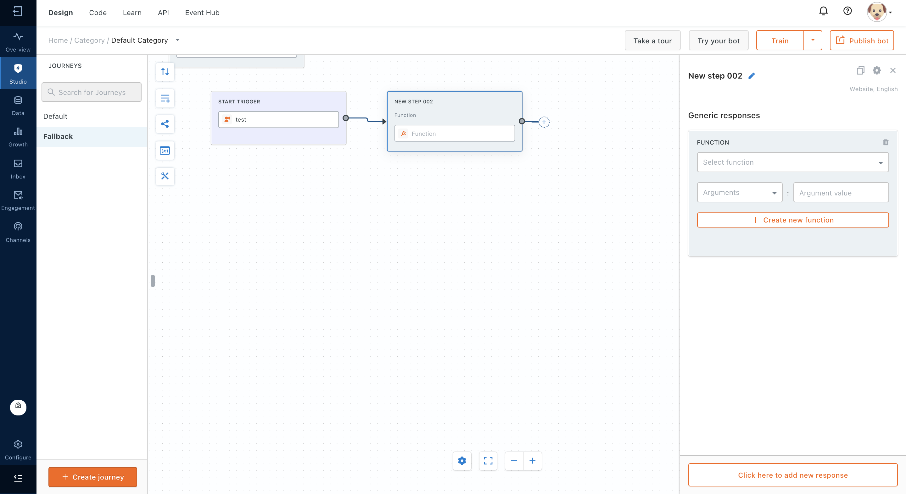


---------------------------------------


### How to create a new database and make changes to it? 

**Keywords** :  create , edit, upload, modify, delete, index, note on indexing issue and red symbol

`Step 1 ` : Adding a new table : You can add a new table by simply clicking on the ‘create table’ button. You can add fields here along with custom mapping of the fields if required. 


`Step 2 ` : Download the table and add/edit/remove any data from this table. Truncate the same table and reupload the new table. As shown in the following steps. 
Edit the table as you want and save it in CSV format. Please make sure that the headers of the table are not changed. 

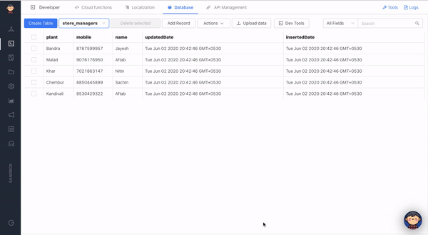

`Step 3` : Truncate the table in the database and upload the new updated table. Please make sure you don’t Drop the table. Dropping the table will delete the table entirely. 

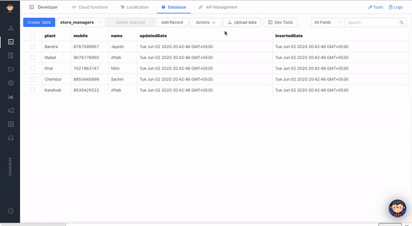

Once changes are made, can upload the table in CSV format back on the same page using 'Upload' button. 


**Note** : When willing to add single record without downloading and uploading, basically without making a fuss.  
Click on ‘Add Record’ and you can add one record at a time.


---------------------------------------


### How to Validate the response of a user? 

Validating any step is as simple as you can think, especially when the expected response from the user if name, email, mobile, location, quick replies or regex. Please regex can be defined here. 

[image to be added for]

---------------------------------------


### How to add a new API?


1. Click on Studio, go to API tab. On the API tab, click on `+ Create new API` button.

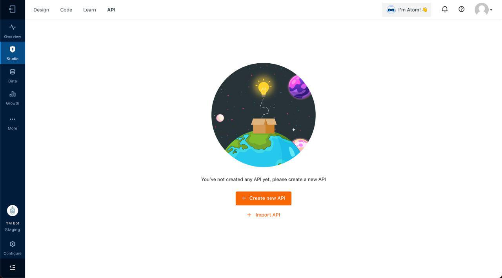

2. Enter an API name. API names are alpha-numeric names in Camel Case and we can not have multiple APIs with the same name. The [joke API](https://official-joke-api.appspot.com/random_joke) used below returns a joke with a punchline in the GET request.

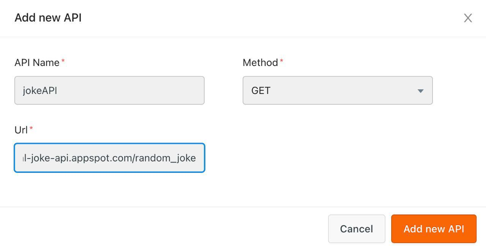

3. Once added, you can test the API by hitting `Send` button. If the API is correctly added and the endpoint works, you should be able to see a sample response as below. 

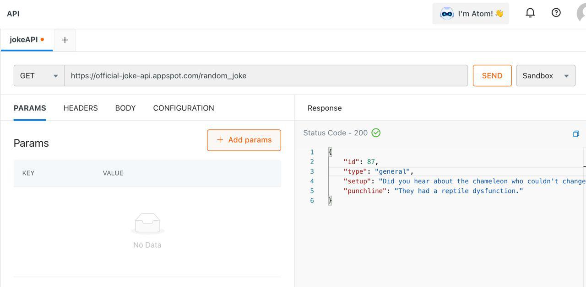

4. Don't forget to click on save button on the bottom left corner, otherwise you won't get a joke. Now you may laugh! :laughing:

---------------------------------------

### How to add a messages to localisation/ rendermsg? 

**Keywords** : localisation

`Step 1` : To Get Started, Click on Localization Tab

`Step 2` :Now add a unique code for this message, and type in a message English(default) .Then Click on “Add Message” and then Click on “Save Settings”

`Step 3` :Now, on the top right corner, select the language for which you want to configure the message in, an Example has been given below.

`Step 4` :Lastly, corresponding to the code , add the message in the configured language field,then click the “Save Settings” button to save changes.


#### SYNTAX:-
Here is the syntax illustrated below:-
app.renderMessage(`code-goes-here`,{input parameters as object(Only if data is passes),”fallback-message”(optional, necessary if i18n:false}) 
USAGE:-
Here is an example illustrated for you:-
```
app.sendTextMessage(app.renderMessage(“new-code”,{},”fall_back_message(if any)”)
app.sendTextMessage(app.renderMessage(“new-code”))
app.sendTexMessage(app.renderMessage("ca-number"),{ca : ca_number},"Here are the details for your CA Number: {{ca_number}}")
```


---------------------------------------

### How to setup did you mean? 

**Keywords** : didyoumean, suggestions

By default, when the bot is not able to understand any message, it displays a default message.
To combat this, we can generally provide custom text or quick replies.

But there is a catch, these responses are static in nature and at times is not what the user is looking for.
It is more intuitive to show some suggestions if they are very close to what the user requested or resemble something in the training of the bot.

For this, a default *didYouMean* function is being made available wherein, just by passing in the *app.prediction.intents*, it can provide you the alternative list of journeys that the bot thinks can be triggered.

>The overriding design goal for didYouMean is to make it as simple as possible to get meaningful suggestions.
The idea is that the developer shouldn’t need to re-invent the wheel and should be able to directly utilise this functionality so as to improve the user experience.

#### Where to call
The *didYouMean** function is being made available as the 2nd function in the list of functions in the Developer section of the platform.

So as not to conflict with existing functionality, it is not added as the Default Action for unidentified utterance. For this, *the developer has to go to Default Journey and add it as the response/action*.

#### Function syntax
```
app.getAlternateJourneyOptions(app.prediction.intents, 0.4, [], []).then((options) => {
    
})
// no catch required 
```

The didYouMean uses a util/helper function app.getAlternateJourneyOptions which provides the options back to the developer for further processing.

The function accepts 4 params as of now:

* app.prediction.intents -> Mandatory. To get all the intents from the prediction.

* confidence -> Optional. Confidence threshold below which the journeys are filtered out from the result. By default, 0.0 to allow all journeys to pass through. The good value will be >=0.4

* journeySlugs -> Optional. An array of journey slug names not to be included in the results.

*categoryNames -> Optional. An array of categories whose journeys will not be included in the results.

The function returns an array of objects called options that can be directly passed to app.sendQuickReplies as options.
If no journeys are present (or filtered out), then an empty array is returned.

The provision for handling both of these functions is present in the UI function.

#### The customization that can be done
In the UI, the following options can be customized:

* scripts -> The text related to didYouMean can be customized according to the requirements and personality of the bot in question.

* Agent Transfer -> If Agent Transfer is present in the bot, you can include the journey explicitly. The provision is shown in the UI under the comments itself.
* Caution - Please include the Agent Transfer journey where you pass journeySlugs so as to not show it as the option in between and most importantly to detect when didYouMean is failing.

#### FAQs
*What if I already have a didYouMean function implemented in my code?*
The didYouMean has been added in such a way that if you already have a function called didYouMean, then the function won’t be overwritten. Though we do advise to give our function a shot as additional features will be tied into the functionality.

*What if I want to add more functionality to the function?*
You are always free to customize the UI function according to your needs.
If in some cases, you feel that some features should be made available by default from the Platform side, you can always drop a message to the below-given details.


---------------------------------------


### How to receive an event from an external third party? 

**Keywords** : receive events

In order to receive events from outside of Yellow Messenger on the YM Platform on any bot we can use the following API : 
[API to added here]

---------------------------------------

### How to do elastic search for database

#### DataStore
The datastore is the local database that is available with each bot instance. It is stored inside MongoDB and is indexed with ElasticSearch.

Each bot’s table gets it’s own index, by default. If needed, you can specify your own elasticsearch mapping to map the database as per your need.

#### Architecture
Each table in the bot gets its own space in MongoDB and gets indexed into elasticsearch.

You can use the UI to create the table, but in order to query through your code, you will need to know how to write elasticsearch queries

A good place to start would be: https://www.elastic.co/guide/en/elasticsearch/reference/6.7/getting-started.html

#### Datastore UI
The datastore in the UI can be accessed through Developer -> Database, herewith referred to as database section in this document

Datastore API
The datastore is available inside the app library and can be accessed with app.dataStore

#### Datastore methods
* search
* insert
* update
* delete
* find
* aggregate
* updateMany
* get
* getForm
* search
The datastore search can be used to search for the record in the table
```
app.datastore.search({
    table: tableName,
    body: esQuery
})
```
*tableName*: The table name that is present in the database section

*esQuery*: The elastic search query that is to be used to search for the records

This function is promisified and hence can be chained for success and reject cases. The chain would go into the reject block in-case of any errors. It is vital to handle this part.

#### insert
The datastore insert function can be used to add records to your table
```
app.datastore.insert({
        table: tableName,
        record: recordObject
    })

```   
*tableName*: The table name that is present in the database section

*recordObject*: The Object containing the key-value pairs of the record. The keys are the column names and the values are the values for the columns. The keys have to match the exact column name present in the table

---------------------------------------
---

<!-- SECTION 3 -->
## Design - Related To BOT UI 

### Change the name,title, sub-title, description of the bot? 

🤓 Trick : If you want to see live preview of the changes you’re making then go to your bot journeys, click on ‘Test your bot' on top right. And click on Bot Direct Link as shown here -

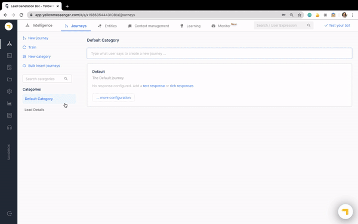

You can also upload a new bot icon here. 

---------------------------------------

### Change the color schema and design of the bot? 

Creativity is intelligence having fun. Better color combinations and effective aesthetics can be a cherry on the cake, so we should make sure that these features, the color, font, etc can be matched with the clients websites and a standard template can be followed for all chatbots.  

`Step 1` : Access Chat Widget here - Go to app.yellowmessenger.com -> Login with YM credentials -> Open a bot -> Go to configurations tab on the left -> Go to Channels at the top -> Click on the first tile there i.e. Chat Widget as show here.

`Step 2` : Under Chat-Widget, you will see the following sections inAppearances and Settings. 

1. Basic 

2. Advance

3. General 

4. Publish your bot : Use the code snippet provided there, add it to the bottom of the ‘body’ tag. This should be shared with the client and can be added to their index.html page. 

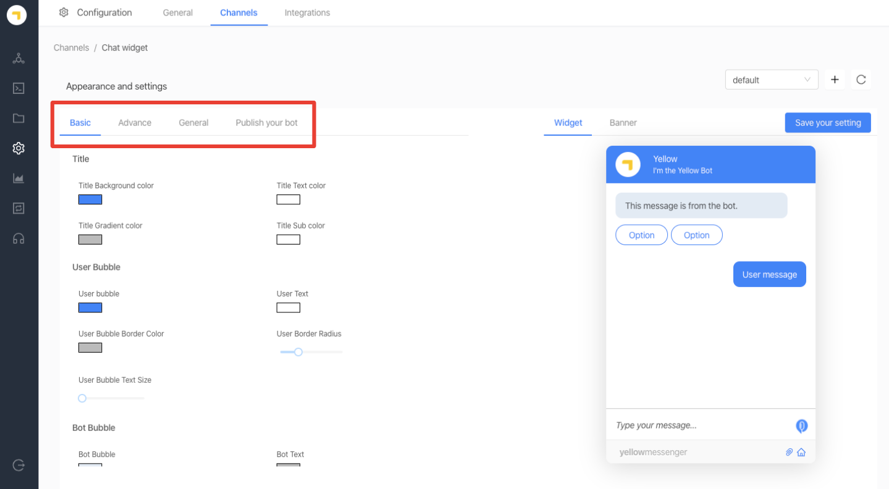

`Step 3` : As highlighted here in the below image. We have default theme selected now, we can change the settings in the four tabs and save it as a theme.   
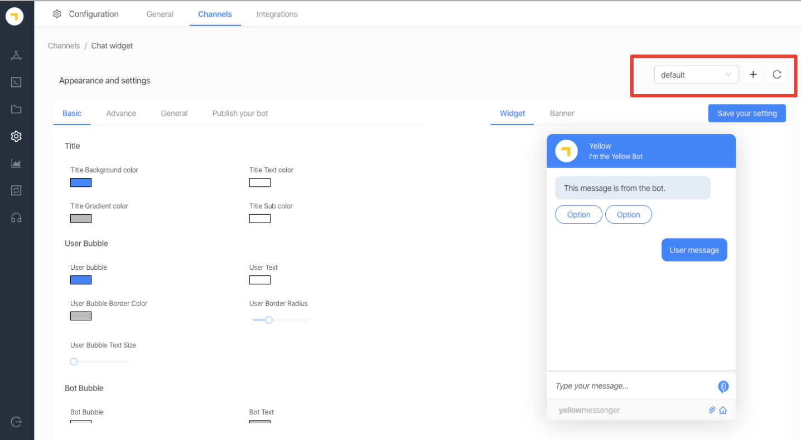

Just one more thing, don’t forget to 'Save your Settings' and your beautiful bot is good to go! 🙂 

---------------------------------------


### How to bulk insert journeys? 

---------------------------------------

### How to change the font of a bot? 
Good fonts means 5 more marks for good handwriting! Haha! Let's see how we can change the font of the bot. 
This document will help in changing font for PWA/ Website Bots. 

**Keywords** : #fonts, #chatWidget #botUI 
**References** : https://fonts.google.com/

`Step 1` : Browse through the [Google fonts ](https://fonts.google.com/)link and choose your favorite style.   

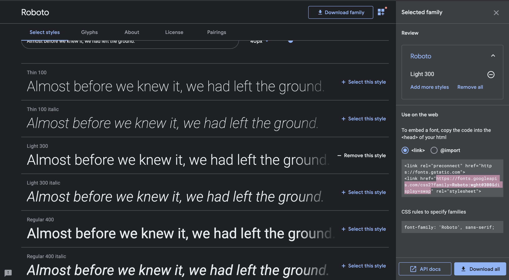


`Step 2` : Select a style, get the URL. URL would look something like this - https://fonts.googleapis.com/css2?family=Roboto:wght@300&display=swap   

`Step 3` : Open this link in a different tab and get the *.woff2* link from there. 
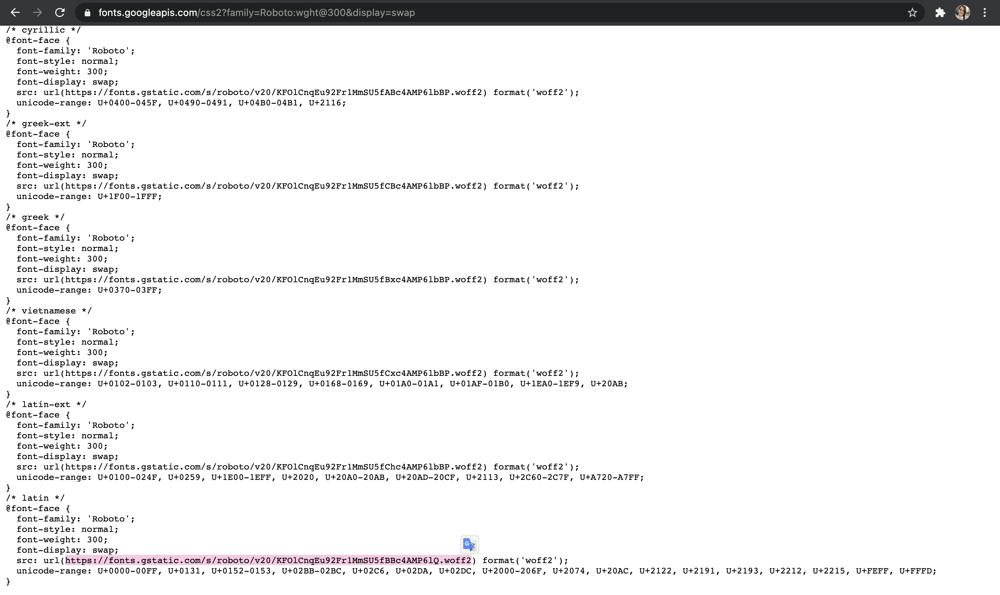

`Step 4` : Now add this link to the Channels > Web > Font > Advanced > Custom Font URL 
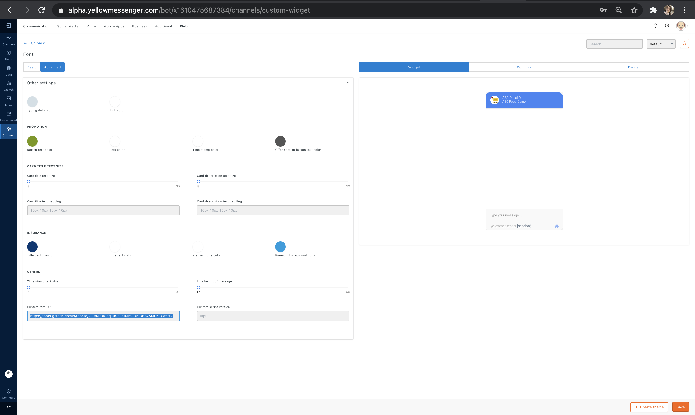


<!-- SECTION 5 -->
## Tricks - All interesting stuff here. 

---------------------------------------

### How to add Contextual Responses? 

**Keywords** : contextual, why, what, how

Setting up contextual responses means adding more context to the response to a particular step. To simplify it further lets take an example  
**Bot** : Can you share your email with me?  
~~**User** : Sure, gooduser@email.com~~   
**Bot** : Why do you need my email?  

What if instead of giving their email address during a conversation, customer asked *What is an email* Or *Why do you need my email*. 
These type of contextual intents can be handled in the following ways :

#### First Way of Adding Contextual Responses : Adding Global Contextual Responses
Setting up standard contextual responses for all steps in all journeys in the bot. Basically if the users ask Why/What/How/ etc at any step, the response will be the same. If you want the same, please follow the following steps : 

`Step 1` : On the Yellow Messenger Platform, under Studio > Learn > Context Management as shown below. 
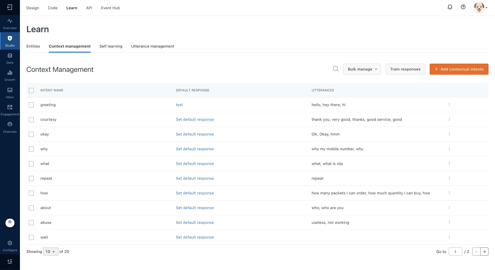

`Step 2` : You can change or add the responses for the various predefined contextual intents like What/Why/How/When/Where/etc. 
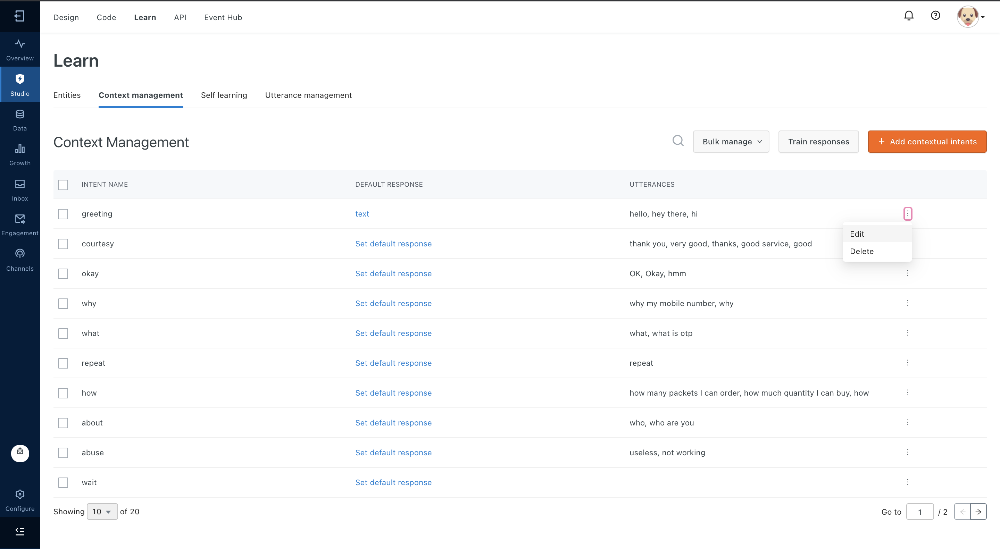

`Step 3` : You can Bulk Upload and Export these intents and responses as well. 
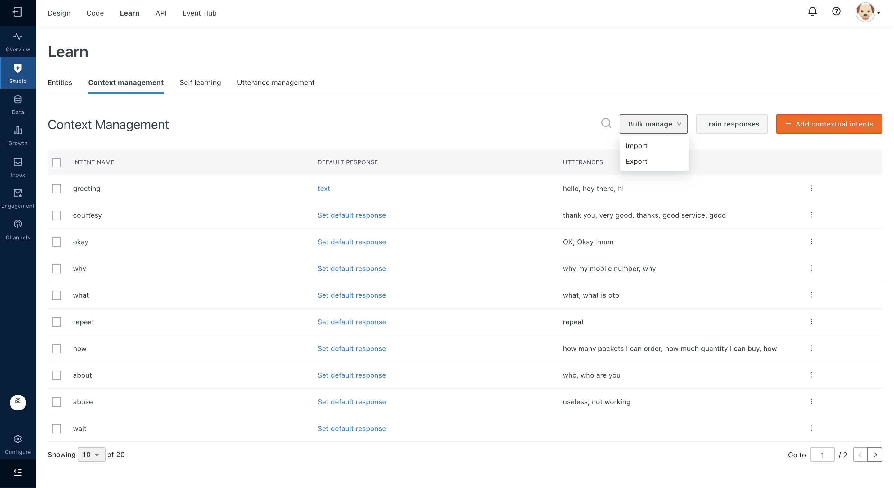

`Step 4` : In order to add new intents click on * '+ Add Contextual Responses'* 
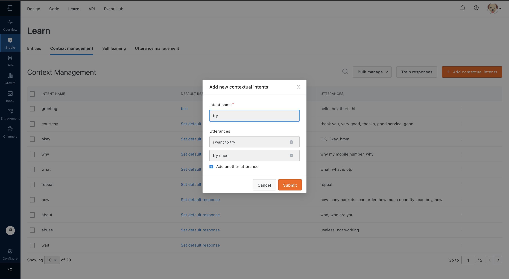

`Step 5` : Add as many training utterances as possible, prompts that the user can type for a particular context. 


Now when the user will ask for these questions [Why/What/How/etc] at any step during the conversation. The bot will be able to send these contexual responses to the user. 

Please note that the user is not moving ahead while user is asking contextual responses. The user will remain at the same step untill the correct response if given. 

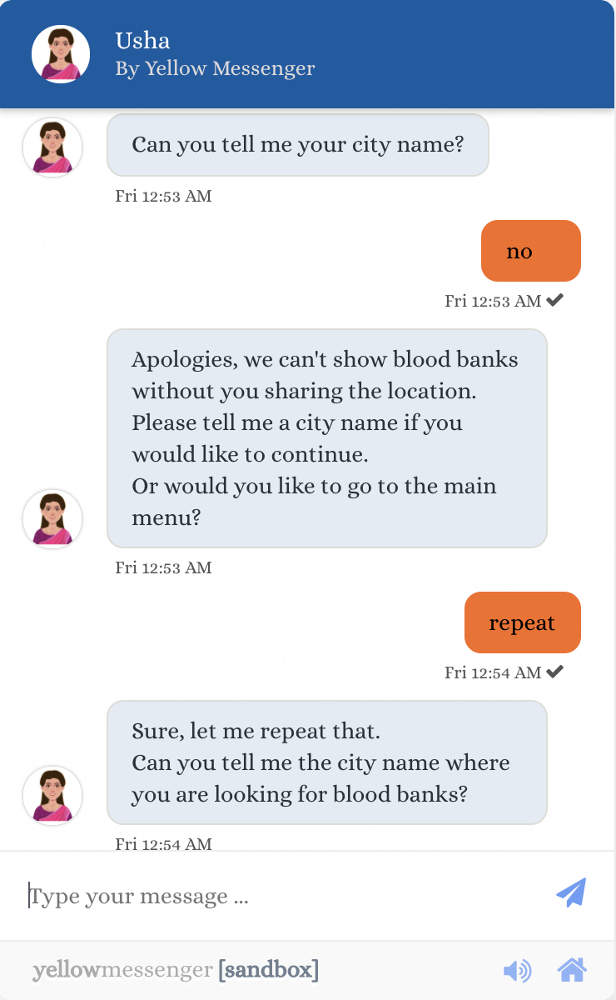


#### Second Way of Adding Contextual Responses : Adding Step Contextual Responses
In case you want a different contextual response at every step in the bot, please follow the given steps : 

`Step 1` : Could not find this in the new platform UI. 

`Step 2` : 


### How to setup context at any step? 

>We humans are always aware of context. Even chatbots also store the context to maintain the state of conversation.
Conversations always happen on a particular topic (like intent), and it is a chain of texts (steps) exchanged between the user and the bot. So, this context keeps the conversation flowing.

This context is stored as a JSON which is constantly updated at each and every step of a conversation. It stores all the info required to identify the state of a conversation, like the *step information* (visited steps), *intent name* (current intent) any many more.
It is available at app.context

```
app.context object
{
   "complete": true,
   "steps": {
        "mobile_num": "9999999999",
       "customer_id": "-",
        "otp": "-"
    },
    "intent": "login"
}
```
At any point, you can access this object to do things like
* getting data of the steps
* knowing the current status of the conversation ( Intent name & the number of steps visited )
* changing a step value

#### Getting data of the steps
* app.context.steps is an object which contains key-value pairs of steps and the step values (user inputs) in the format step_name: step_value
* A new step is added into app.context.steps only after the validation of that step.
* When it hits an intent, this steps object is initially empty
* 
#### Getting Intent name
* app.context.intent contains the current intent name

#### Other data
(Very limited use cases though)

* app.context.complete contains a boolean value. If it’s true then the intent is done with visiting all the steps
* app.dataHistory contains an array of most recent incoming messages to the bot 
In action function, you can make use of this app.context object to get all the required information to process the answer.

A typical action function below
```
return new Promise(resolve => {

    // Getting the data from the steps
    let otp = app.context.steps.otp
    let mobile = app.context.steps['mobile_number'] // another way of accessing data

    // API CALL which requires the above data
    // api logic here
    
    app.sendTextMessage('You have been successfully logged in')

    resolve();
});

```

This object is always updated for every intent. When it hits another intent all the steps data will erased and the intent name will be changed.


